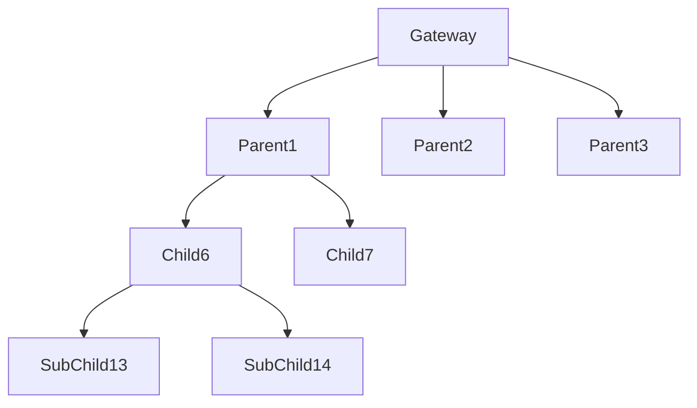

# NRF24L01 IoT Mesh Network with Node-Limit Addressing

## Network Topology




An IoT wireless sensor network using **NRF24L01 modules** built on top of:

- RF24
- RF24Network
- RF24Mesh

This project demonstrates a **hierarchical mesh network** with **controlled node addressing using a Node-Limits Approach**.

The network consists of:

- 1 Gateway / Master Node
- Parent Nodes
- Child Nodes
- Sub-Child Nodes

Each node periodically transmits **sensor state (LED/Digital Pin)** to the **Gateway**, while the gateway dynamically assigns IDs within predefined ranges.

---

# Network Architecture

```
                 [ Gateway / Master ]
                         |
          -----------------------------------
          |        |        |        |      |
       Parent1  Parent2  Parent3  Parent4 Parent5
          |
      ---------
      |       |
   Child6   Child7 ...
      |
   ----------
   |        |
SubChild13 SubChild14 ...
```

This design ensures **structured routing and predictable addressing**, useful in **large IoT deployments**.

---

# Addressing Strategy — Node Limits Approach

The network assigns **ID ranges for each hierarchy level**.

| Node Type | ID Range | Maximum Nodes |
|-----------|----------|---------------|
| Gateway | 0 | 1 |
| Parent Nodes | 1 – 5 | 5 |
| Child Nodes | 6 – 12 | 7 |
| Sub-Child Nodes | 13 – 20 | 8 |

This ensures:

- Controlled scaling
- Clear routing hierarchy
- Easier debugging
- Predictable topology

---

# Node Limit Approach vs Other RF24 Approaches

| Approach | Max Nodes | Best Use Case |
|--------|--------|--------|
| RF24Mesh (Single Master) | ~50–156 | Small–Medium Sensor Networks |
| RF24Network (Static Addressing) | ~156 | Structured Networks |
| MySensors Approach | 255 | Home Automation |
| Direct Star Network | 255 | Simple Master-Slave Systems |
| Multiple Mesh Networks (MQTT Bridge) | 1000+ | Large Industrial IoT |

This project focuses on a **controlled mesh hierarchy using node ranges**.

---

# Hardware Requirements

- Arduino / ESP32 / Compatible MCU
- NRF24L01 Transceiver Modules
- Jumper wires
- Breadboard
- Sensor / Input pin (used here: **D5**)

Recommended:

- NRF24L01 with external antenna
- 10µF capacitor across VCC–GND

---

# Libraries Required

Install the following libraries in Arduino IDE:

```
RF24
RF24Network
RF24Mesh
SPI
```

GitHub Sources:

- https://github.com/nRF24/RF24
- https://github.com/nRF24/RF24Network
- https://github.com/nRF24/RF24Mesh

---

# Node Types

## Gateway / Master Node

Responsibilities:

- Initialize mesh network
- Assign IDs dynamically
- Manage DHCP
- Receive sensor data

ID ranges allocated:

```
Parent IDs   : 1 – 5
Child IDs    : 6 – 12
SubChild IDs : 13 – 20
```

Key features:

- Dynamic ID allocation
- Category-based node assignment
- Network monitoring via Serial

---

## Parent Nodes (Type 1)

ID Range

```
1 – 5
```

Responsibilities:

- Connect directly to Gateway
- Forward Child node messages
- Read sensor state from D5

Example message:

```
LED STATE (HIGH) of NODE ID 2 (Parent)
```

---

## Child Nodes (Type 2)

ID Range

```
6 – 12
```

Responsibilities:

- Connect via Parent nodes
- Read sensor state
- Forward data to Gateway through Parent

Example message:

```
LED STATE (LOW) of NODE ID 7 (Child) via Parent NODE ID 2
```

---

## Sub-Child Nodes (Type 3)

ID Range

```
13 – 20
```

Responsibilities:

- Connect via Child nodes
- Multi-hop routing
- Forward sensor data up the hierarchy

Example message:

```
LED STATE (HIGH) of NODE ID 15 (SubChild) via Child NODE ID 8 via Parent NODE ID 3
```

---

# Message Flow

```
SubChild → Child → Parent → Gateway
```

All nodes periodically send **digital pin state (D5)** to the gateway.

---

# File Structure

```
NRF24-IoT-Network
│
├── gateway
│   └── gateway_master.ino
│
├── parent_node
│   └── parent_node.ino
│
├── child_node
│   └── child_node.ino
│
├── subchild_node
│   └── subchild_node.ino
│
└── README.md
```

---

# Gateway Code Logic

1. Start RF24Mesh
2. Listen for node requests
3. Identify node type
4. Assign ID within range
5. Maintain network using DHCP

Pseudo logic:

```
if node_type == parent
    assign ID 1–5
if node_type == child
    assign ID 6–12
if node_type == subchild
    assign ID 13–20
```

---

# Example Serial Output

Gateway:

```
Gateway Node Initialized
Assigned ID 1 to Node Type 1
Assigned ID 6 to Node Type 2
Assigned ID 13 to Node Type 3
```

Parent Node:

```
Parent Node Starting...
LED STATE (HIGH) of NODE ID 1 (Parent)
```

Child Node:

```
Child Node Starting...
LED STATE (LOW) of NODE ID 7 (Child) via Parent NODE ID 1
```

SubChild Node:

```
Sub-Child Node Starting...
LED STATE (HIGH) of NODE ID 15 (SubChild) via Child NODE ID 7 via Parent NODE ID 1
```

---

# Applications

This architecture can be used for:

- Smart Agriculture
- Industrial IoT Monitoring
- Large Sensor Networks
- Home Automation
- Environmental Monitoring

---

# Possible Improvements

Future enhancements:

- Sensor data aggregation
- Node failure detection
- MQTT gateway bridge
- Web dashboard visualization
- Low-power sleep nodes
- Multi-gateway scaling

---

# Author

IoT Mesh Networking Experiment using **NRF24L01 + RF24Mesh** with hierarchical addressing and dynamic node assignment.
